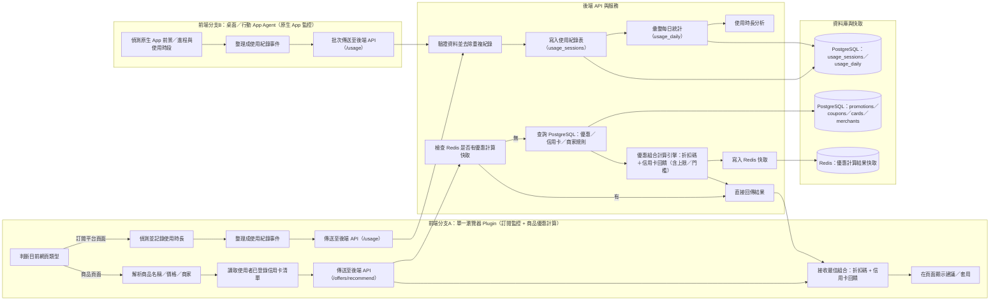

```mermaid
flowchart LR
  %% 前端
  subgraph FE1[前端分支A：單一瀏覽器 Plugin（訂閱監控 + 商品優惠計算）]
    P1[判斷目前網頁類型] 
    P1 -->|訂閱平台頁面| P2[偵測並記錄使用時長]
    P1 -->|商品頁面| P3[解析商品名稱／價格／商家]
    P2 --> P4[整理成使用紀錄事件] --> P5[傳送至後端 API（/usage）]
    P3 --> P6[讀取使用者已登錄信用卡清單] --> P7[傳送至後端 API（/offers/recommend）]
    P7 --> P8[接收最佳組合：折扣碼 + 信用卡回饋]
    P8 --> P9[在頁面顯示建議／套用]
  end

  subgraph FE3[前端分支B：桌面／行動 App Agent（原生 App 監控）]
    D1[偵測原生 App 前景／進程與使用時段] --> D2[整理成使用紀錄事件] --> D3[批次傳送至後端 API（/usage）]
  end

  %% 後端
  subgraph BE[後端 API 與服務]
    A1[驗證資料並去除重複紀錄] --> A2[寫入使用紀錄表（usage_sessions）]
    A2 --> A3[彙整每日統計（usage_daily）]
    A3 --> A4[使用時長分析]

    R1[檢查 Redis 是否有優惠計算快取] -->|有| R4[直接回傳結果]
    R1 -->|無| R2[查詢 PostgreSQL：優惠／信用卡／商家規則]
    R2 --> R3[優惠組合計算引擎：折扣碼＋信用卡回饋（含上限／門檻）]
    R3 --> R5[寫入 Redis 快取]
    R3 --> R4
  end

  %% 資料層
  subgraph DB[資料庫與快取]
    S1[(PostgreSQL：usage_sessions／usage_daily)]
    S2[(PostgreSQL：promotions／coupons／cards／merchants)]
    S3[(Redis：優惠計算結果快取)]
  end

  %% 連線 - 監控
  P5 --> A1
  D3 --> A1
  A2 --> S1
  A3 --> S1

  %% 連線 - 優惠計算
  P7 --> R1
  R2 --> S2
  R5 --> S3
  R4 --> P8
```
